# Low Dose CT Denoising using Cycle GAN
### Using Low Dose CT data from [AAPM](https://www.aapm.org/)

You can find details about Low Dose CT Grand Challenge from this [Official Website.](https://www.aapm.org/grandchallenge/lowdosect/#trainingData)

You can download data set(~8.3GB) from [data link.](https://drive.google.com/drive/folders/1pC7Coiu3bcPAy2Kno7b6jdyLzcs-G1Gz?usp=sharing)

Download the ```data.zip``` and place ```data``` folder in main project directory.

- - -

## Objective
- The goal of this challenge and our project is to denoise low dose(quarter dose) CT Image to get high dose(full dose) CT Image.

## Data Preview
Inside the ```data``` folder you will find two sub folder ```qd``` and ```fd``` each representing quarter dose and full dose.

Quarter dose corresponds to low dose and full dose corresponds to high dose.

Typical data look like below.

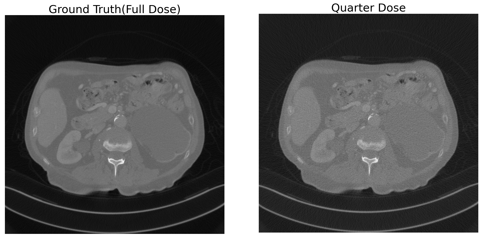

You can see the noise in quarter dose image compared to full dose image. 

For clarity, I also included center cropped image below.

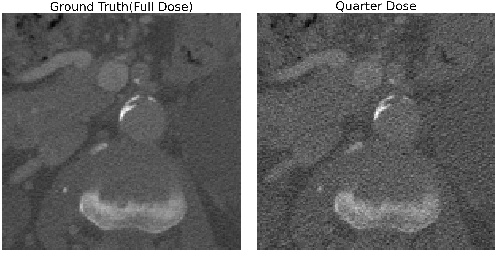

## Model Structure

We mainly followed [Original paper](https://arxiv.org/abs/1703.10593?amp=1) and [Official Implementation.](https://github.com/junyanz/pytorch-CycleGAN-and-pix2pix)

### Generator

For the generator, we used ***U-net*** based generator. 

U-net based generator's structure is not presented in Cycle GAN paper, but you can find code in the official implementation. -> [Link](https://github.com/junyanz/pytorch-CycleGAN-and-pix2pix/blob/9bcef69d5b39385d18afad3d5a839a02ae0b43e7/models/networks.py#L436)

Following exact same structure given in official code, we made U-net generator structure image, presented below.


From the above structure, we made slight change for our task.

1. In the Cycle GAN author's U-net generator, they did't used concatenation at the outter most layer, but we found that for denoising task, concatenating input layer to output layer improves denoising ability. And to make final output image have one color channel, we used Convolutional2D layer with kernel=1, stride=1. Just adding the 2 channel in channel axis to make output one channel performed poor.

2. At the final output we didn't use ```tanh``` activation. Instead we just used raw output from last Convolutional2D layer.

Out final model structure are given below.


### Discriminator

For the discriminator, we used 70X70 ***PatchGAN***. Which was introduced in original paper and also you can find detail implementation in official code.

For those of you wandering what PathGAN is, I recommend this [website](https://sahiltinky94.medium.com/understanding-patchgan-9f3c8380c207) to understand what it is.

We just used PatchGAN presented in [this code.](https://github.com/junyanz/pytorch-CycleGAN-and-pix2pix/blob/9bcef69d5b39385d18afad3d5a839a02ae0b43e7/models/networks.py#L538) And below is the detail structure of 70X70 PatchGAN.


### Train Result

We used same parameters and learning rate as in original paper. 

Below is the PSNR(Peak Signal to Noise Ratio) between Ground truth(full dose CT image) with U-net generator generated image.

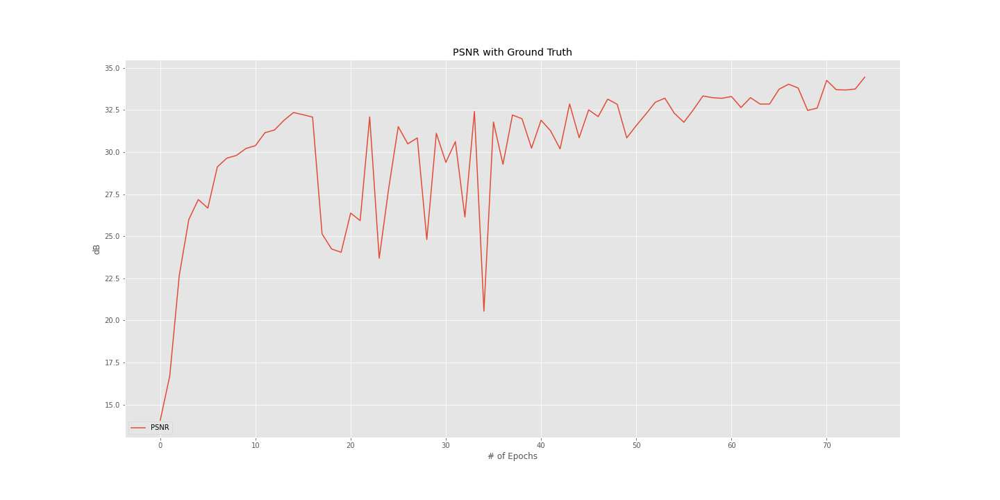

For the other loss values during training, you can find graph image inside ```images_README``` folder.

- - -

## PSNR & SSIM

- PSNR
  - Average **PSNR** between Test set Quarter Dose and Test set Full Dose: 26.9565dB
  - Average **PSNR** between Test set Full Dose and U-net Generator generated image: 34.4406dB
  - **PSNR** gain: ```7.4842dB```
- SSIM
  - Average **SSIM** between Test set Quarter Dose and Test set Full Dose: 0.6988
  - Average **SSIM** between Test set Full Dose and U-net Generator generated image: 0.8598
  - **SSIM** gain: ```0.1610```
  
 ## Results
 (PSNR, SSIM with respect to Full Dose)
 
 - Full Image (512X512 size)
 
 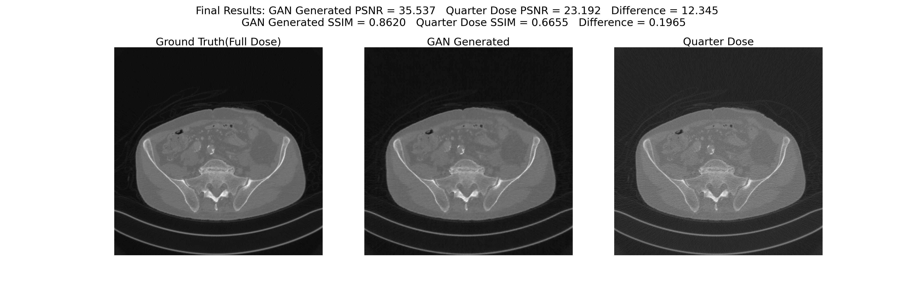
 
 - Center Cropped Image (150X150 size)
 
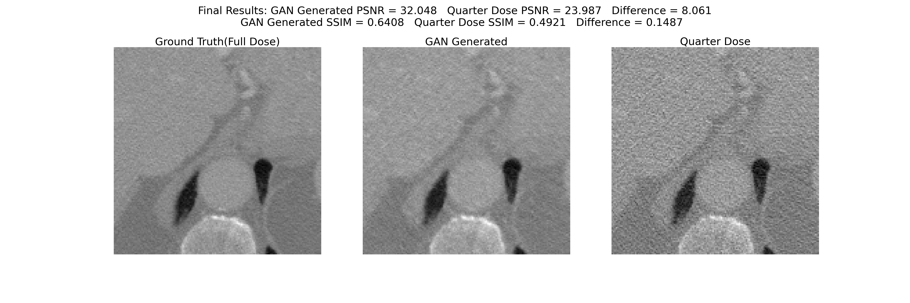
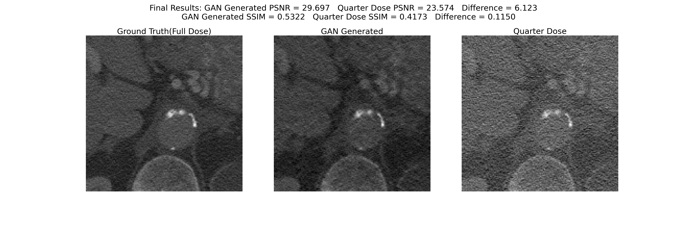
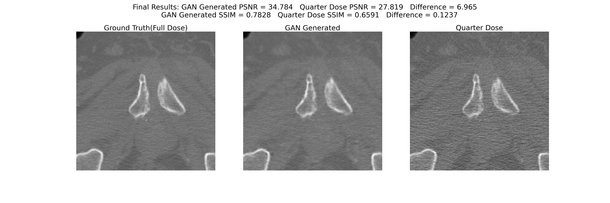

- Noise Comparison

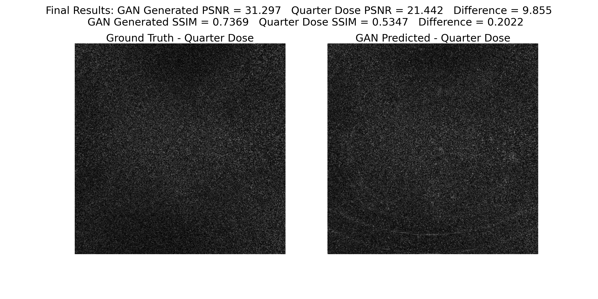

Left image is the noise(difference between full dose and quarter dose) and the right image is the noise(difference between generated signal and quarter dose) eliminated by Cycle GAN. You can see that Cycle GAN properly eliminates noise from quarter dose signal.

- - -

## Code Structure & Explanation

### 0. Data Download
- Download [data.zip](https://drive.google.com/drive/folders/1pC7Coiu3bcPAy2Kno7b6jdyLzcs-G1Gz?usp=sharing) and place ```data``` folder, containing ```test``` and ```train``` subfolder, inside the main project directory.
### 1. Data Preprocessing
- No data preprocessing is used. We will use raw signal data from ```data``` as input to model.
- The only processing used is ```torchvision.transforms.RandomCrop``` to downsize image from 512X512 to 256X256.
### 2. Training
- Run ```train.ipynb```. Model will be saved under ```final_result``` folder.
- Run ```tensorboard --logdir ./runs``` to monitor training.
### 3. Inference
- Run ```inference.ipynb```. You can get PSNR and SSIM value for your trained model.
- Inside ```inference.ipynb``` you can find ```plot_result``` function. It will generate image like the one in Result section. ```crop``` parameter will center crop the image to given size. ```save``` parameter will save image under the folder ```final_image``` or ```final_image_center``` if you use ```crop``` parameter.
- ```plot_reult_diff``` generate image like the one in Noise Comparison. Parameters are same as ```plot_result``` function. It will save image under the folder ```final_image_diff``` or ```final_image_diff_center``` if you use ```crop``` parameter.

To use pretrained model, download [models.zip](https://drive.google.com/drive/folders/1pC7Coiu3bcPAy2Kno7b6jdyLzcs-G1Gz?usp=sharing) and place the unzipped folders (Discriminator_A, GAN_FD_to_QD...) under ```final_result``` folder. If you don't have ```final_result``` folder, you have to make it in the main project directory. And go to ```Step 3```

- - -

## Additional

### Loss Function

 We present Loss function used for generator and discriminator. Although loss function equation is well explained in the original paper, there is no one complete equation in the paper. So we organized the loss functions in one equation.
 
 We follow the notation given in the original paper. Check the image below. (Reference: [Original paper figure 3](https://arxiv.org/abs/1703.10593?amp=1))
 
 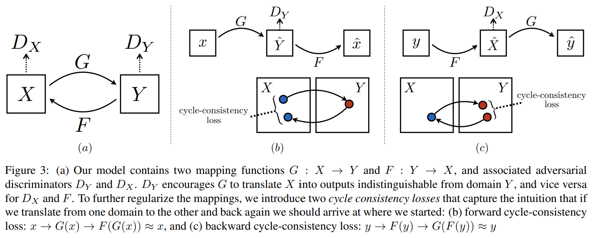
 
 - Generator Loss Function
 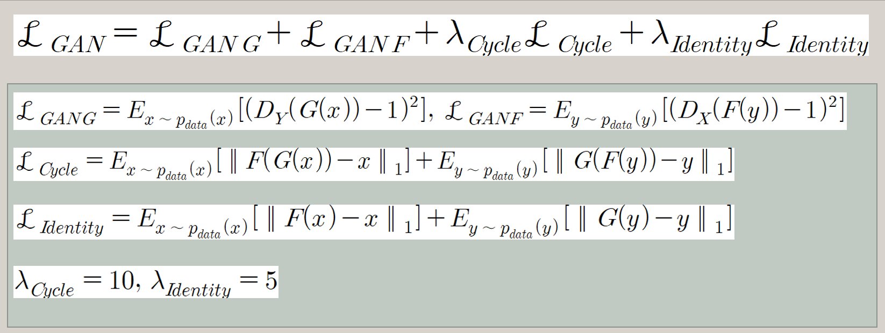
 
 - Discriminator Loss Function
 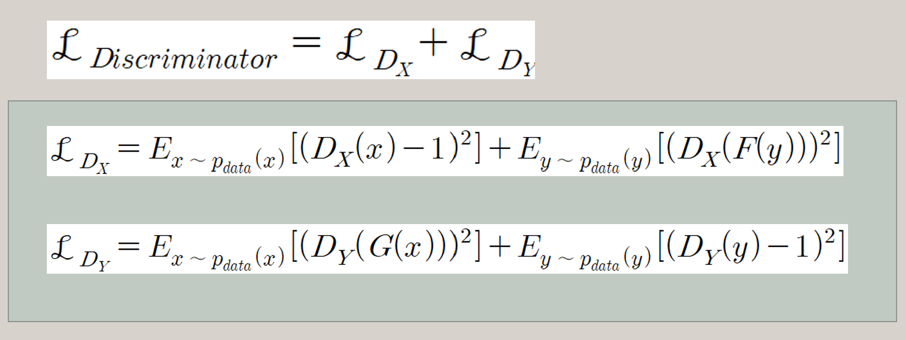
 
 ### Hyperparameter
 
 We tested for various U-net depth(7 layer, 8 layer, 9 layer) where layer represents one concatenation, so our final model presented above is 8 layer U-net Generator.
 
 | # of layers | PSNR Gain(dB) | Center Cropped image(350X350) PSNR Gain(dB) | SSIM Gain | Center Cropped image(350X350) SSIM Gain | Noise PSNR|
 | --- | --- | --- | --- | --- | --- |
 | 7 layer | 6.6638 | 4.8668 | 0.1484 | 0.1187 | 19.8380 |
 | 8 layer | **7.4842** | **5.2259** | **0.1610** | **0.1236** | **19.9271** |
 | 9 layer | 7.3119 | 4.6682 | 0.1555 | 0.1048 | 19.6466 |
 
 For 7 layer, 8 layer U-net generator, we used RandomCrop with 256X256 size and trained with total 80 epochs. For 9 layer U-net generator 256X256 input is unavailable so we used full size image(512X512 size) and trained for 30 epochs. As you can see our best model was achevied using 8 layer U-net.
